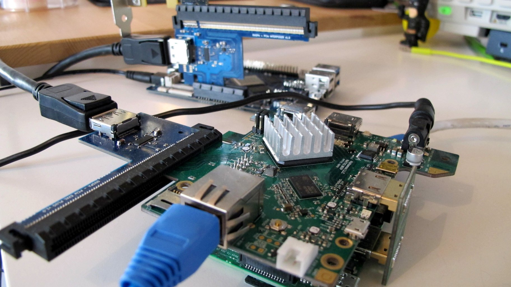

```
                      ___  _________      ___             __
                     / _ \/ ___/  _/__   / _ | ___  ___ _/ /_ _____ ___ ____
                    / ___/ /___/ // -_) / __ |/ _ \/ _ `/ / // /_ // -_) __/
                   /_/   \___/___/\__/ /_/ |_/_//_/\_,_/_/\_, //__/\__/_/
                                                         /___/
                             Copyright (c) 2019-2020, EnjoyDigital
                             Copyright (c) 2019-2020, Franck Jullien
                                   Powered by Migen & LiteX
```


# PCIe analyzer experiments



The aim of this project is to create a PCIe interposer + FPGA capture board for PCIe signals capture and analysis.

## Prerequisites
Python 3.6 and Xilinx Vivado installed.

## Installing LiteX
```sh
$ wget https://raw.githubusercontent.com/enjoy-digital/litex/master/litex_setup.py
$ chmod +x litex_setup.py
$ sudo ./litex_setup.py init install
```
## Building design
```sh
$ ./target.py (can be ac701, netv2)
```

## PCIe interposer and receiver Hardware
The PCIe interposer and receiver boards have been designed by Franck Jullien and are still in prototype stage. More information on the hardware and availability will be added soon.
